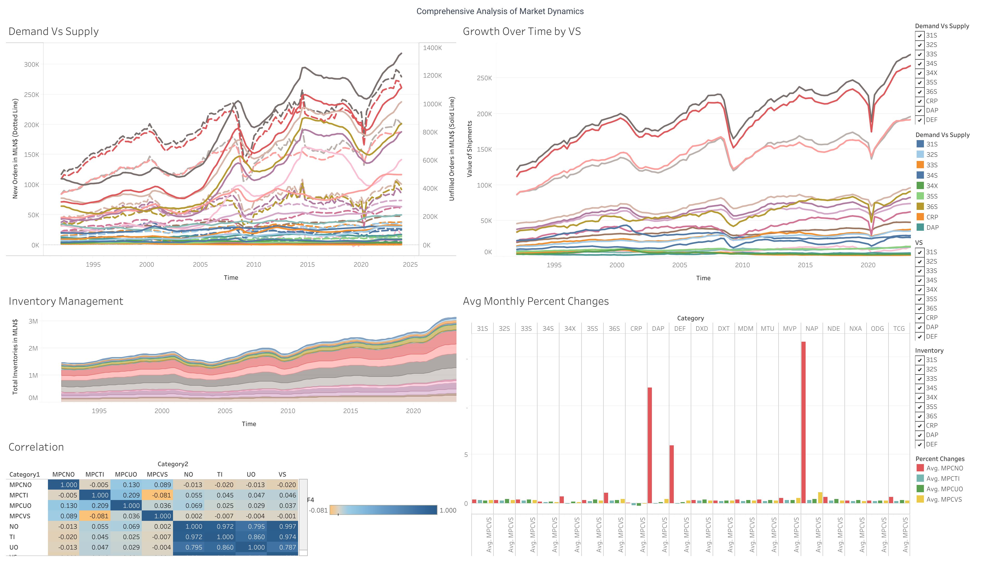

# Data Exploration on the Economic Indicator - Durable Goods Manufacturers' Shipments, Inventories, and Orders

This project focuses on the Economic Indicator, specifically the Durable Goods Manufacturers' Shipments, Inventories, and Orders. Leveraging API keys for seamless data loading, the project encompasses three key phases: Data Loading, Data Preparation, and Exploratory Data Analysis (EDA).

## Data Loading

The project begins with a robust data loading mechanism, utilizing API keys for secure and efficient retrieval of the Monthly Advance Report dataset. The API key integration ensures seamless access to the latest and most accurate data, facilitating a dynamic and up-to-date analysis environment.

## Data Preparation

In this phase, the dataset undergoes thorough preparation to ensure its suitability for analysis. This includes data cleaning, handling missing values, and transforming variables for optimal compatibility with exploratory analytics tools. The goal is to create a clean and structured dataset that lays the foundation for meaningful insights.

## Exploratory Data Analysis (EDA)

The prepared dataset is subjected to a comprehensive exploration. Through statistical summaries, visualizations, and correlation analyses, the project aims to uncover patterns, trends, and key insights within the Monthly Advance Report.

## Dependencies

To run the project, ensure you have the necessary dependencies listed in the [requirements.txt](./requirements.txt) file.

## File Descriptions

- **[EDA.ipynb](./EDA.ipynb):**

  - This Jupyter Notebook file contains the code and results of the Data Loading, Data Preparation and Exploratory Data Analysis (EDA).

- **[q3_prepared.csv](./q3_prepared.csv):**

  - This CSV file contains the prepared dataset resulting from the data loading and data preparation phases. The EDA.ipynb notebook uses this file for analysis and visualization.

- **[Dashboard.twbx](./Dashboard.twbx):**

  - This file is the Tableau Workbook itself. It contains the interactive dashboard along with the underlying data connections, calculated fields, and other configurations.

- **[Dashboard.pdf](./Dashboard.pdf):**

  - This file is a PDF version of the Tableau dashboard. It provides a viewable representation of the visualizations and insights generated from the EDA results.

- **[Dashboard.png](./Dashboard.png):**

  - Similar to the PDF file, this is an image (PNG) version of the Tableau dashboard.

- **[requirements.txt](./requirements.txt):**
  - This file lists the Python packages and their versions required for running the code in EDA.ipynb.
